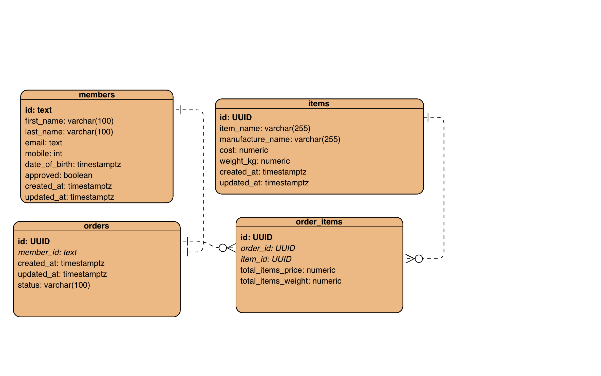

# Database

## 1. Entity Relationship Diagram



## 2. Setup `postgresql` locally using `docker-compose`

- Create database credentials inside `.env`
```bash
POSTGRES_USER=postgres
POSTGRES_PASSWORD=postgres
POSTGRES_DB=postgres
```

- `DDL` script to create tables base on above ER: `./schema/init.sql`

- Start-up the database
```bash
make up
```

- Shutdown the database
```bash
make down
```

- Shutdown and remove all data
```bash
make clean_down
```

- After the `database` is up, use this: http://localhost:8080/ to access database admin page

## 3. Query the database

- Which are the top 10 members by spending? [Answer](scripts/top10_spending_members.sql)
- Which are the top 3 items that are frequently brought by members? [Answer](scripts/top3_frequent_items.sql)