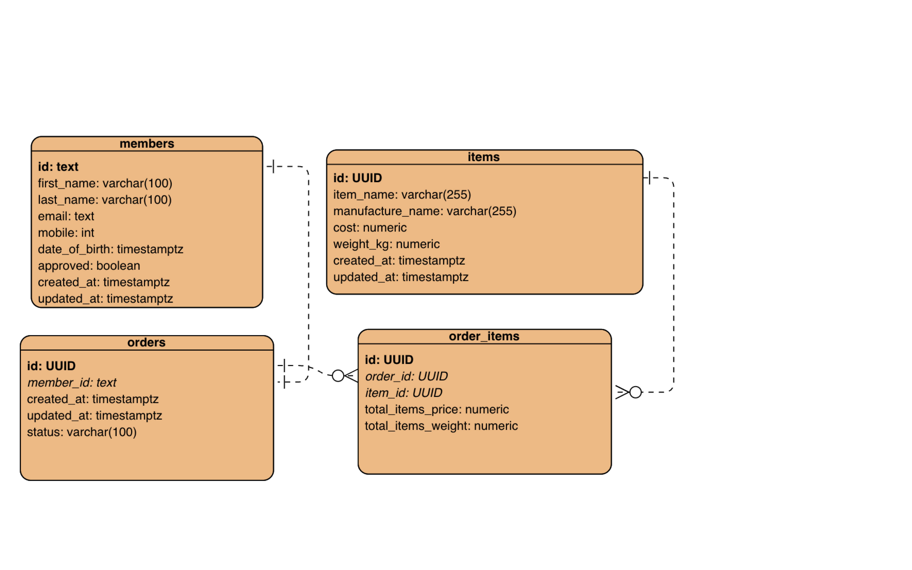
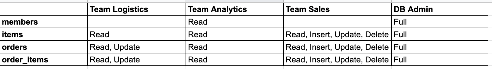

# Data Access Strategy

## 1. Database Diagram 

## 2. Requirements
This database will be used by several teams within the company to track the orders of members

- <b>Logistics</b>:
  - Get the sales details (in particular the weight of the total items bought)
  - Update the table for completed transactions

- <b>Analytics</b>:
  - Perform analysis on the sales and membership status
  - Should not be able to perform updates on any tables

- <b>Sales</b>:
  - Update database with new items
  - Remove old items from database
  
## 3. Strategy
We will have to create one account for each team with following access permission at table level:

