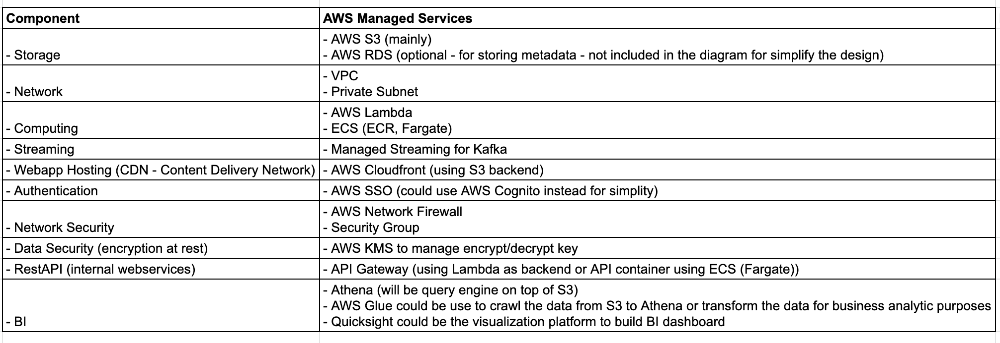

# AWS Data Infrastructure

## 1. Problem

You are designing data infrastructure on the cloud for a company whose main business is in processing images.

The company has a web application which allows users to upload images to the cloud using an API. There is also a separate web application which hosts a Kafka stream that uploads images to the same cloud environment. This Kafka stream has to be managed by the company's engineers. 

Code has already been written by the company's software engineers to process the images. This code has to be hosted on the cloud. For archival purposes, the images and its metadata has to be stored in the cloud environment for 7 days, after which it has to be purged from the environment for compliance and privacy. The cloud environment should also host a Business Intelligence resource where the company's analysts can access and perform analytical computation on the data stored.

As a technical lead of the company, you are required to produce a system architecture diagram (Visio, PowerPoint, draw.io) depicting the end-to-end flow of the aforementioned pipeline. You may use any of the cloud providers (e.g. AWS, Azure, GCP) to host the environment. The architecture should specifically address the requirements/concerns above. 

In addition, you will need to address several key points brought by stakeholders. These includes:
- Securing access to the environment and its resources as the company expands
- Security of data at rest and in transit
- Scaling to meet user demand while keeping costs low
- Maintainance of the environment and assets (including processing scripts)

You will need to ensure that the architecture takes into account the best practices of cloud computing. This includes (non-exhaustive):
- Managability
- Scalability
- Secure
- High Availability
- Elastic
- Fault Tolerant and Disaster Recovery
- Efficient
- Low Latency
- Least Privilege

Do indicate any assumptions you have made regarding the architecture. You are required to provide a detailed explanation on the diagram.

## 2. Proposed Architecture

## 2. Explanation

- <b>System analysis</b>

  - This is a system to allow people to upload & process image. Image is normally big size type of file which will require significant amount of space to store the image
  - Store the image in hard-disk should not be ideal way. It should be store in a much cheaper storage like cloud storage (S3, GCS ...) for cost-efficient purpose
  - To comply with data compliance & privacy, the data will have 7 days data retention policy which would be easily to achieve with cloud storage like S3 by setting storage lifecycle 
  - For easy of maintenance, cost-efficient & highly secure purpose, we should prefer serverless architecture over traditional architecture (setup dedicated server - 24/7 up and running)

- <b>In conclusion:</b> `AWS` has been chosen as our main cloud service provider over `Azure` and `GCP` due to the reason of highly proficient in `AWS` and wide-range of serverless managed services for our needs

- <b>Services Selection</b>

- There two main web application:
  
  - `Webapp 1` (for example: https://webapp1.com) : will be deployed statically in S3 and using CloudFront to be CDN (AWS Route3 could be used to configure the DNS and AWS Certificate Manger to create SSL certificate to enable HTTPS). This application will interact with an internal API (AWS Gateway API + Lambda) to request for S3 signed url (with 30 minutes - 1 hour expiry). The app will process the uploaded image from end-user and use the signed URL to put the object to the dedicated S3 bucket
  
  - `Webapp 2` (for example: https://webapp2.com) : will be deployed similar to `Webapp 1` (using CloudFront + S3). This will interact with an internal container API (managed by ECS cluster and Fargate in private subnet inside VPC). This API will be the proxy to communicate (publish) the image to predefined topic in Kafka. There will be another private AWS Lambda function (deployed inside VPC) which will subscribe the Kafka's topic and process/upload the object to the dedicated S3 bucket

  - For scalability purposes, we will use Network Load Balancer for the container API of `Webapp 2`
  
  - For network security, AWS Firewall rule will be introduced as well as the Security Group on top of each private subnet
  
  - For data security (data encryption), S3 bucket will be encrypted at rest using custom key which will be managed KMS. The IAM role will be created at specific bucket/folder level for each component to read/write object to S3
  
  