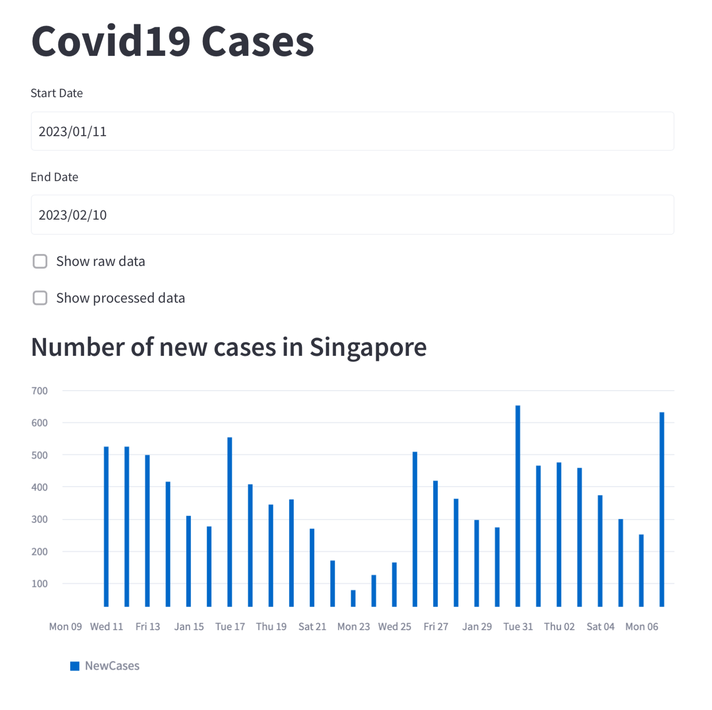

# Chart & API

## 1. Requirement

Your team decided to design a dashboard to display the statistic of COVID19 cases. You are tasked to display one of the components of the dashboard which is to display a visualisation representation of number of COVID19 cases in Singapore over time.

Your team decided to use the public data from https://documenter.getpostman.com/view/10808728/SzS8rjbc#b07f97ba-24f4-4ebe-ad71-97fa35f3b683.

Display a graph to show the number cases in Singapore over time using the APIs from https://covid19api.com/.

Note: please submit screenshots of the dashboard

## 2. Solution

- Using `requests` package to download the data from public API: https://covid19api.com/
- Using `streamlit` package to create iterative dashboard, refer to: https://streamlit.io/ 
- The data will be very big if download everything since Covid started. Hence we allow end-user to pickup `Start Date` and `End Date`. Default last 1 month from current date

### 2. 1. Run the dashboard locally
- Create virtual environment and install required packages
```bash
make venv
```

- Run the dashboard
```bash
make app
```

- Access to the dashboard: http://localhost:8501/

